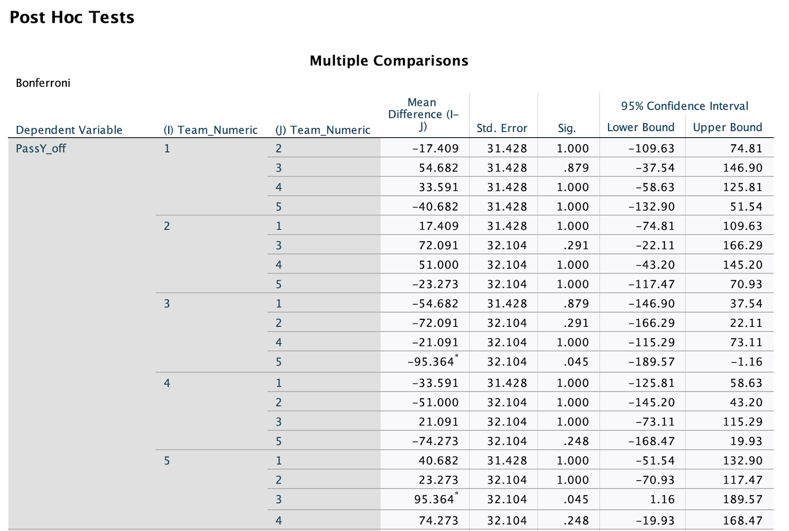

# NFL Stochastic Analysis

Lukas Dudzik, Manav Sharma, John Curanaj, Jonathan Als

December 7, 2022

Professor John Linde

MATH 4581

## What question are we trying to answer?

In the NFL, the top five football teams based on win percentage (as of December 4th, 2022) are the Buffalo Bills (.750 win pct.), Miami Dolphins (.727 win pct.), Philadelphia Eagles (.917 win pct.), Minnesota Vikings (.833 win pct.), and the Kansas City Chiefs (.818 win pct.). 

Although these teams currently rank the highest this season, at face value it is unclear how exactly this success is generated. For this reason, this analysis dives deeper into the offensive statistics of these five teams to answer the question: **do the offensive strategies of the top five teams in the NFL significantly differ from one another?** This information will provide a better understanding as to whether or not there is one clear offensive strategy that drives team success or if there are multiple techniques to garner success in the league. 

In order to answer the main question of the analysis, sub questions need to be answered and analyzed in order to collectively provide us the information desired. The four questions are as follow: 

* Does the number of average pass yards per game significantly differ between the five teams?
* Does the number of average rush yards per game significantly differ between the five teams?
* Do the five teams have a significantly different average number of players with significant pass contribution?
* Do the five teams have a significantly different average number of players with significant rush contribution?

The data from these analyses will help us answer whether or not teams have unique passing and rushing strategies, as well as if their offensive strategies are a team effort or dependent on certain star players. 

## Where did we get the data?

We needed statistics for each game that the top five football teams based on win percentage (as of December 4th, 2022).

For most of our data, we retrieved it from Pro-Football-References as a csv file. This data was not very clean, so we loaded it into a Pandas dataframe in a Python notebook. 

From there, we dropped 5 columns that were undefined as NaN (not a number) values (4, 5, 6, 9, 26). We also dropped columns that we didn’t need for the analysis such as “Day”, “Date”, and “OT” (2, 3, 7). We did not need “Day” and “Date” because we already had a “Week” column to designate when the game was played. The column “OT” was removed because we did not include an overtime game as a variable in our analysis.

The data also included games that were scheduled but not played yet, so we needed to remove their values. 

Finally, as we conducted our analysis, we realized we wanted to include a more granular view of each game. We decided to include the number of players that had significant rush contributions (> 2 per game) and the number of players that had significant pass contributions (> 2 per game) for each game. 

We scraped this data manually from Google Sports, wrote it into an Excel spreadsheet, and combined it with the initial dataframe using Python.

## What stats are we using?

For each team, four statistics were taken into account:

1. Average pass yards per game.
2. Average rush yards per game.
3. Average number of player with significant pass contributions (> 2 per game)*
4. Average number of player with significant rush contributions (> 2 per game)*

Within the data, each team’s averages were based on their first 11 games except for the Buffalo Bills, who already had 12 games worth of data.

* **During an NFL game, there are many players that catch or run 1-2 times. Such a contribution was not deemed substantial enough to consider this player a significant player in the game. For this reason, only players with rush or pass contributions greater than 2 were considered in the analysis**

## Results

Within the testing, each team was associated with a nominal value:

 

1 → Bills

2 → Dolphins

3 → Eagles

4 → Vikings

5 → Chiefs

